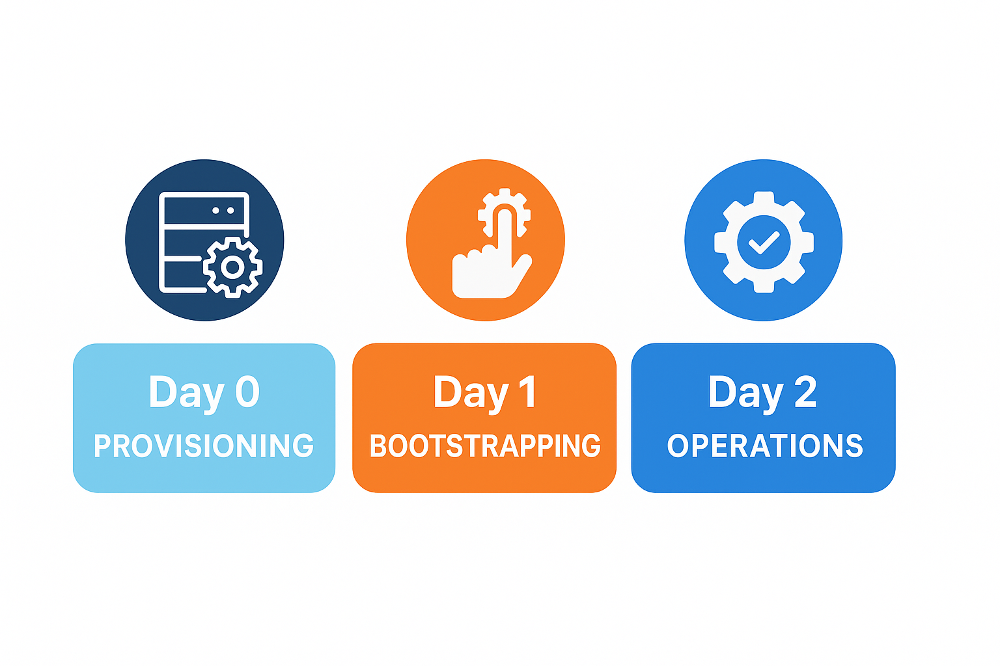

# Infrastructure Automation with Ansible
## Table of Contents
- [Core Concepts](#core-concepts)
  - [Infrastructure as Code (IaC)](#infrastructure-as-code-iac)
  - [IaC vs Configuration Management](#iac-vs-configuration-management)
  - [Key Principles of IaC](#key-principles-of-iac)
  - [Automation Lifecycle](#automation-lifecycle)
    - [Day 0 – Provisioning](#day-0--provisioning)
    - [Day 1 – Bootstrapping](#day-1--bootstrapping)
    - [Day 2 – Operations and Maintenance](#day-2--operations-and-maintenance)
- [Ansible Concepts](#ansible-concepts)
  - [Scaffolding a Role](#scaffolding-a-role)
  - [Common Commands](#common-commands)
## Core Concepts
### Infrastructure as Code (IaC)

**Infrastructure as Code (IaC)** is the practice of defining, managing, and provisioning infrastructure, such as servers, networks, and services, using machine-readable configuration files rather than manual procedures or ad‑hoc scripts.  
The goal is to treat infrastructure like software: **version-controlled, reviewable, testable, and reproducible**.

Instead of “clicking through” interfaces or running commands manually, the desired state of the infrastructure is defined in code and applied automatically.  
This allows environments to be created, destroyed, and recreated consistently across development, staging, and production.

---

### IaC vs Configuration Management

Although the terms often overlap, it’s useful to distinguish between the two approaches:

- **Infrastructure as Code (IaC):** focuses on *provisioning* and *orchestrating* physical or virtual resources, servers, networks, load balancers, storage volumes, etc.  
  *Examples:* Terraform, CloudFormation, Ansible (in some cases).

- **Configuration as Code (CaC):** focuses on *configuring* the software and services that run on those resources, installing packages, managing files, starting services, and enforcing policies.  
  *Examples:* Ansible, Puppet, Chef.

Both approaches complement each other: IaC builds the environment, while CaC ensures it runs as intended.  
In practice, many teams use “IaC” to describe the combination of both provisioning and configuration management, and this repository follows that convention.

---

### Key Principles of IaC

- **Idempotence**  
  Running automation repeatedly should always yield the same result.  
  Tasks must be safe to reapply without unwanted side effects.

- **Declarative over Imperative**  
  Focus on *what* the final state should be (“nginx is installed and running”) rather than *how* to achieve it step by step.

- **Composability and Reuse**  
  Build small, focused roles and playbooks that can be combined to manage complex systems.

- **Observability and Safety**  
  Include validation, logging, and safe defaults to ensure automation remains transparent and predictable.

By applying these principles, Infrastructure as Code turns manual configuration into a controlled, repeatable process, making infrastructure changes traceable, reversible, and auditable.

---

### Automation Lifecycle

Modern infrastructure management benefits from a clear separation of lifecycle stages.  
By distinguishing **Day 0**, **Day 1**, and **Day 2** operations, automation can be made safer, more repeatable, and easier to evolve.  
Each phase builds on the previous one: **Day 0 makes a system reachable, Day 1 makes it manageable, and Day 2 keeps it consistent and secure.**



#### Day 0 – Provisioning
Day 0 prepares a machine or environment so that it becomes accessible for automation.  
At this stage, configuration management tools like Ansible are not yet involved, the goal is simply to have a running operating system with remote access.

Typical tasks include:
- Installing or flashing the base OS.  
- Configuring hostname, networking, and SSH access.  
- Adding control-plane public keys or temporary credentials.

In cloud or virtualized environments, this is often handled by prebuilt images or provisioning tools like **Terraform**.  
For physical or homelab systems, it is usually performed manually or through imaging scripts.

#### Day 1 – Bootstrapping
Once the system is reachable, Day 1 automation transforms it into a **managed host**.  
The goal is to establish a uniform and secure baseline so configuration management can take over safely.

Typical tasks include:
- Creating a dedicated automation or admin user and deploying SSH keys or API credentials.  
- Installing Python and essential runtime dependencies.  
- Granting controlled privilege escalation (sudo).  
- Applying minimal configuration (timezone, locale, base packages).  

This phase typically runs once per host, it’s the “import” step that brings new machines into the managed fleet.  
Bootstrap playbooks should remain simple, idempotent, and safe to re-run.

#### Day 2 – Operations and Maintenance
Day 2 automation represents the steady-state phase of infrastructure management.  
At this point, configuration management continuously enforces the desired state while applying updates and security policies.

Typical tasks include:
- Applying system configuration and security hardening.  
- Managing networking, services, and application settings.  
- Installing and updating software (containers, orchestration agents, monitoring tools).  
- Running periodic updates, backups, and integrity checks.  
- Detecting and remediating configuration drift.  

Day 2 operations can be either **recurring automation** (scheduled updates, backups) or **ad‑hoc automation** (deploying new services, applying one-time changes).  
Most Infrastructure‑as‑Code effort resides here, where modular, declarative, and idempotent design provides the most long‑term value.

---

## Ansible Concepts

Ansible is a lightweight, agentless automation tool that describes infrastructure and configuration as code.  
A typical Ansible project includes several core components:

- **Playbooks**: YAML files that define the desired state of systems: **what** to apply, and to **which hosts**.  
- **Roles**: reusable collections of tasks, templates, files, and variables. Roles make automation modular, maintainable, and easy to test.  
- **Inventory**: defines the hosts and groups managed by Ansible, along with their connection details and variables.

For detailed explanations and advanced usage, see the official [Ansible documentation](https://docs.ansible.com/ansible/latest/getting_started/index.html).

---

### Scaffolding a Role

To create a new role, use the Ansible Galaxy command:

```bash
ansible-galaxy init roles/<role_name>
```

You can think of **Ansible Galaxy** as a package manager for roles and collections.  
Once created, roles can be shared within your organization or published to the public Galaxy repository.

Include the role in a playbook:
```yaml
- hosts: managed
  become: true
  roles:
    - role: myrole
```

---

### Common Commands

Run a playbook against your inventory:
```bash
ansible-playbook -i inventories/prod/hosts.ini playbooks/site.yml
```

Check connectivity to all hosts:
```bash
ansible all -m ping -i inventories/prod/hosts.ini
```

Limit execution to a single host:
```bash
ansible-playbook playbooks/site.yml --limit srvprod01
```

Run specific tags:
```bash
ansible-playbook playbooks/site.yml --tags hardening,network
```

---
## Roles

This repository is organized into modular Ansible roles:

- [x] [common](roles/common/README.md) — Ensures basic system setup, locales, and essential packages.  
- [x] [debian_hardening](roles/debian_hardening/README.md) — Applies Debian-specific hardening policies and security configuration.  
- [x] [network](roles/network/README.md) — Manages interface configuration and DNS. 
- [ ] raspberry specific role 
- [ ] [docker](roles/docker/README.md) — Installs and configures Docker Engine and container runtime settings.  
- [ ] [backup](roles/backup/README.md) — Configures automated backups and restore routines.  
- [ ] [monitoring](roles/monitoring/README.md) — Sets up metrics, logging, and alerting for managed hosts.  
- [ ] [updates](roles/updates/README.md) — Handles automatic package updates and version pinning.  

You can navigate to each role’s folder to view its dedicated README and implementation details.
